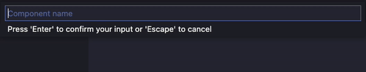
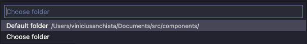
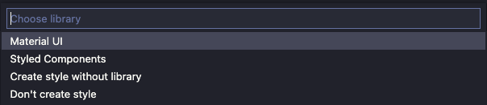
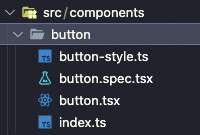

# Generate component and style

This extension generates a component and style for the given component name.

## About

This extension the component with the given name, generates a test file with the [testing-library react](https://testing-library.com/react) library and the style that we can choose from 3 possibilities:
- [Material-UI](https://material-ui.com/)
- [Styled-Components](https://styled-components.com/)
- Style without library
- Without style

## Usage

### Step 1:
- After the extension is installed, press the `Ctrl+Shift+P` or `Cmd+Shift+P` key combination to open the command palette.
- Type `generate component` and press `Enter` to generate a component.

<p align="left">
  
</p>

### Step 2:
- Type the component name and press `Enter`.

<p align="left">
  
</p>

### Step 3:
- Choose the folder where you want to generate the component or choose path default (`src/components`).
- `Warning: Option Default folder is not available. Will soon be available!`.

<p align="left">
  
</p>

### Step 4:
- Choose the style library you want to use.
- Choose between `Material-UI` or `Styled-Components` or `Style without library` or `Without style`.


<p align="left">
  
</p>

### Result:
- The component is generated in the folder you choose with files:
  - `component-style.ts`
  - `component.spec.tsx`
  - `component.tsx`
  - `index.ts`
    - Ps. All the files that are generated, contain the start code in each one.

<p align="left">
  
</p>

## Requirements

If you want to use the style library `Material-UI`, you need to install the `@material-ui/core` package.
```bash
npm install @material-ui/core
```
If you want to use the style library `Styled-Components`, you need to install the `styled-components` package.
```bash
npm install styled-components
```
If you want to use the test library `testing-library react`, you need to install the `@testing-library/react` package.
```bash
npm install @testing-library/react
```

## I am here

<a href="https://www.linkedin.com/in/viniciusanchieta/" target="_blank"></a>


